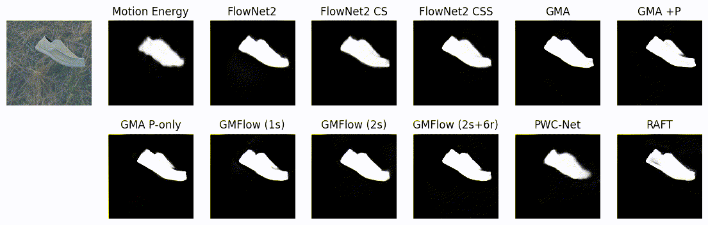

# Object segmentation from common fate:<br> Motion energy processing enables human-like zero-shot generalization to random dot stimuli

Matthias Tangemann, Matthias Kümmerer, Matthias Bethge

[BethgeLab](https://bethgelab.org/) at University of Tübingen, Tübingen AI Center

[[arXiv](https://arxiv.org/abs/2411.01505)] • [[NeurIPS](https://neurips.cc/virtual/2024/poster/95285)]


## Overview
We train deep neural networks for segmenting moving objects based on a broad range of
motion estimation models. We then evaluate the zero-shot generalization of these models
to random dot stimuli for which only the motion, but not appearance is informative about
the object.




We find that a classic motion energy model generalizes much better to random dot stimuli
than state-of-the-art optical flow models. We further show that the motion energy model
is the only model to match human performance in a direct comparison.

Please have a look at the [paper](https://arxiv.org/abs/2411.01505) for more details.


## Usage
The following sections describe how to generate the datasets, train the models, and
evaluate them on the human subject study. Skip ahead to
[Datasets and models](#dataset-and-models) if you want to use the precomputed datasets
and models.

### 1. Generating the *Single Moving Object* dataset
The dataset was generated using [Kubric](https://github.com/google-research/kubric). The
worker script is located in [`dataset/worker.py`](dataset/worker.py). Use the run script
to generate the entire dataset:

```bash
cd dataset
python run.py
```


### 2. Training models
Please install all dependencies first by running

```bash
pip install -e .
```

All code for training the models is located in the `motion_energy_segmentation` package.
Execute the following command to train model:

```
python -m motion_energy_segmentation.train --config configs/$CONFIG.yaml [--output $OUTPUT_PATH]
```

When using optical flow models as motion estimator, you need to download the respective
checkpoint first from the original sources and adapt the config file to point to the
correct path. The following models were used in the paper:

- FlowFormer++: https://github.com/XiaoyuShi97/FlowFormerPlusPlus
- GMFlow: https://github.com/autonomousvision/unimatch/blob/master/MODEL_ZOO.md
- All other models: https://github.com/open-mmlab/mmflow/blob/master/docs/en/model_zoo.md


### 3. Generating the shape identification stimuli (human subject study)
All code for the human-machine comparison is located in the `human_subject_study`
directory. Generate the data and experiment files by running:

```bash
cd human_subject_study
python generate_experiment.py --config config.yaml [--output $OUTPUT_PATH]
```

### 4. Evaluating models for shape identification
To evaluate the models on the shape identification task, run the following command:

```bash
python -m motion_energy_segmentation.evaluate_shape_identification \
    --config configs/$CONFIG.yaml \
    --checkpoint path/to/checkpoint.pth \
    --data-path path/to/human_subject_study/data \
    [--output-path $OUTPUT_PATH]
```


## Datasets and pretrained model
The datasets and model weights are available from Huggingface:

- [Model weights](https://huggingface.co/bethgelab/motion_energy_segmentation_model/resolve/main/motion_energy_segmentation_model.pth?download=true)
- [Single Moving Object dataset](https://huggingface.co/datasets/bethgelab/motion_energy_segmentation_datasets/resolve/main/single_moving_object_dataset.zip?download=true)
- Human subject study: [stimuli](https://huggingface.co/datasets/bethgelab/motion_energy_segmentation_datasets/resolve/main/human_subject_study_stimuli.zip?download=true), [responses](https://huggingface.co/datasets/bethgelab/motion_energy_segmentation_datasets/resolve/main/human_subject_study_responses.csv?download=true)


## External code
This repository contains code that was adapted from the following external sources:

- FlowFormer++: https://github.com/XiaoyuShi97/FlowFormerPlusPlus
- GMFlow: https://github.com/autonomousvision/unimatch
- jspsych: https://github.com/jspsych/jsPsych

Please refer to the respective repositories for the original license information.


## Citation
If you find this work useful, please consider citing:

```
@inproceedings{tangemann2021object,
  title={Object segmentation from common fate: Motion energy processing enables human-like zero-shot generalization to random dot stimuli},
  author={Tangemann, Matthias and K{\"u}mmerer, Matthias and Bethge, Matthias},
  booktitle={Advances in Neural Information Processing Systems},
  year={2024}
}
```

Please don't forget cite the authors of all motion models that you are using.

